# TBMOBA Simulator Beta v1.0
Developer(s): Jason Huang

[Github Repository Link](https://github.com/thefireblade/TB-MOBA-Simulator)

TBMOBA, Turn-based Multiplayer Online Battle Arena, simulator is an open-source Android simulator that runs a simple MOBA game as turn-based. Development on this project is currently in progress as more features will be added with each new update. Feel free to contribute to this project by submitting pull request.

# Current Features
  - Online registration + data storage for offline games
  - Choose 1 of 3 classes when loading a game (Archer, Sword, and Shield). Each specializing in certain stat fields
  - Buy/Sell items and move around a Single Lane Map. (Graphics in progress)
  - Fully functional AI that will spawn at the enemy base and attempt to destroy your defensive zones.
  - Simulate a simple game with movement, rest, attack, and shop.
  - Toggle notifications in the settings page

## The Game Layout

TBMOBA Simulator composes of several layouts, each documented and with their own set of functions to the application.
***
#### Splash Screen
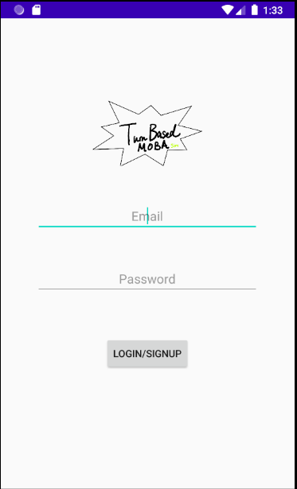

##### Frontend

- The splash screen contains two EditText Fields and a button to login. There is a custom amateur logo for this splash page.

##### Backend

- Use of Google Firebase Authentication to login and store user information. You must login/create an account in order to properly query data.

- If you enter the wrong password or attempt to create an account that already exist, you will get an error message under the login/signup button (the keyboard doesn't go away after clicking the button).

- **Known Issues**: There is no loading indicator for the application. Login time will vary based on connection

***
#### The Menu
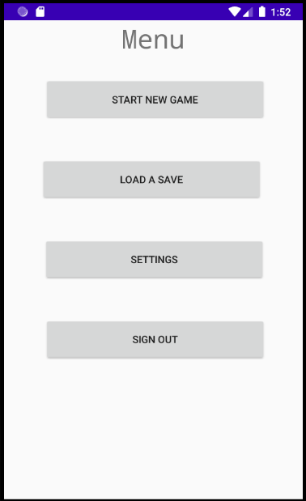

##### Frontend

- There are 4 buttons in total. "Start New Game", "Load a Save", "Settings", and "Sign out". Each verbose in its functionality.

##### Backend

- In this page, there are queries to the database to populate the app's information with the necessary globals to run the game.

- Start Game opens a new Activity pop up view, the load a save game will open up an activity to a list of saves and the settings button will open up a new activity to the settings page.

- **Known Issues**: If you sign out of the menu while the data is being queried, you may run into a Firebase Authentication Error. This may or may not affect the application's performance.

***
#### The Saves
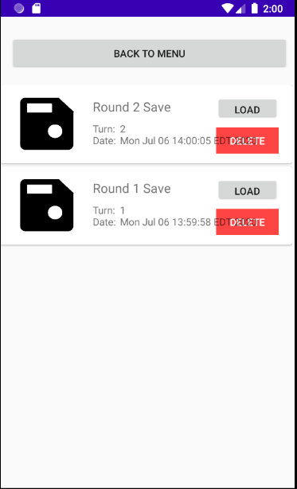

##### Frontend

- The load a saves page contains a list of save items that you have saved previously to the cloud. The save will contain an image of a save Icon that I drew (Custom) and have the name of the Save as well as the date and time of creation. There are 2 buttons on each item and it's "Load" and "Delete". There is a "Back To Menu" button.

##### Backend

- "Back to Menu" button finishes the activity and takes you back to the previous activity.

- The table can be empty if no saves were loaded. The saves are stored as SaveObjects created in the file structure. 

- Delete on each table cell calls a query to delete in the database. Load will load a new game and start a new activity.

- **Known Issues**: Date text overlaps the delete button. Save images are constant.
***
#### The Settings Page
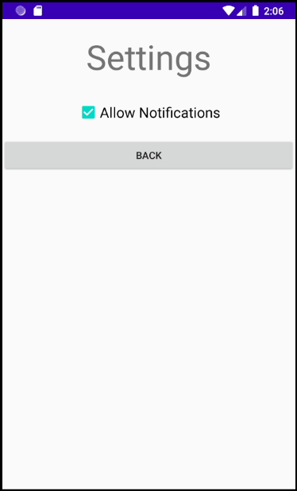

##### Frontend

- Contains a checkbox to allow notifications. Contains a button to go back to previous activity.
##### Backend

- Allow Notification has a listener that makes queries to the database. Everytime it is clicked, an update is sent to the database for user settings.

- The back button takes you back to the previous activity by calling finish();

- **Known Issues**: You can DOS the database by rapidly clicking on the checkbox.
***
#### Loading a Gamemode
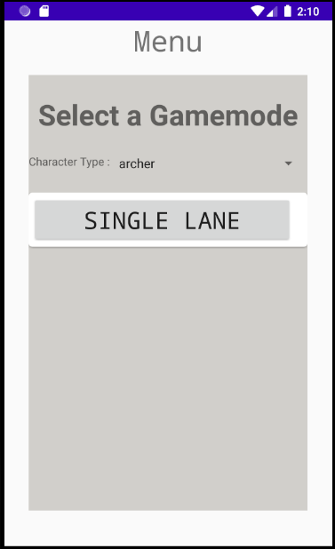

##### Frontend

- A pop up window will appear (with a darker tint than the menu background) and you'll have the choice to choose a gamemode (currently, only single lane is available). There is a spinner that contains the classes "archer", "sword", and "shield".

##### Backend

- Each Table Cell is a large button with the text changed. Clicking on it will load the game view.

- **Known Issues**: N/A
***
#### In-Game + Mechanics
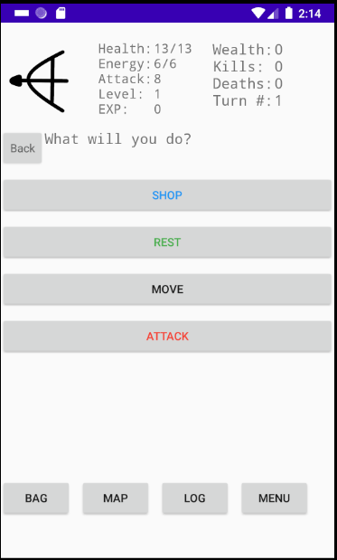

##### Frontend

- This is the in-game view. You will have a choice to go through several options - SHOP, REST, MOVE, or ATTACK. The "Back" button is there for you to to traverse backwards through this menu. The bottom buttons - BAG, MAP, LOG, MENU each are popups that allow you to traverse through the application, get information about the turn, or play the game. 

##### Backend

- The image to the top left changes based on which class you choose.

- "Rest" will restore 50% of your health and energy and will use up one turn.

- "Move" will allow you to move to an adjacent location abd use one turn. In single lane, the locations are connected as follows in a acyclic path: HOME_0 -> INNER_0 -> OUTER_0 -> CENTER <- OUTER_1 <- INNER_1 <- HOME_1.

- In single player mode, the player always moves before the AI. This may change after future updates.

- "Attack" will only show targets if there is an enemy in the location you are in. You can only attack towers only after you destroy the enemy AI (or player) in the area. Attack will use 1 turn and damage will be calculated based on your current attack stat.

- If you die, you respawn back your starting location at once every 5th round. Same goes for the enemy. 

- Buying an item will not take a turn. You gain 2 Wealth as well as 1 Exp every round. You do not gain wealth or exp if you are dead (same goes for AI).

- You can only shop and rest at your base. You will lose these options if you move out to a different location.

- There are 2 teams presently. You are on team_0, the AI is on team_1.

- The end game conditions is that either you or your enemy takes down all of the defensive structure on either sides of the map. Any location ending with _0 indicates your team, otherwise it is your enemy's location.

- **Known Issues**: Concurrency issues has been introduced when implementing AI logic. When rapidly making move commands, there is a small chance for the application to glitch or crash.
***
#### In-Game Views
##### Shop
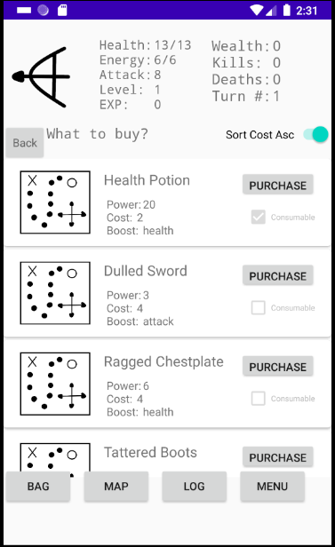

##### Movement
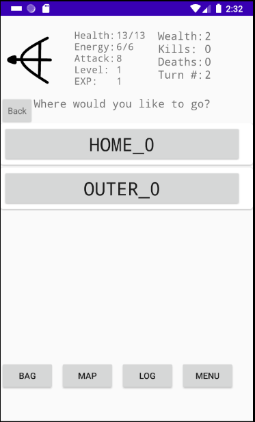

##### Outside Base
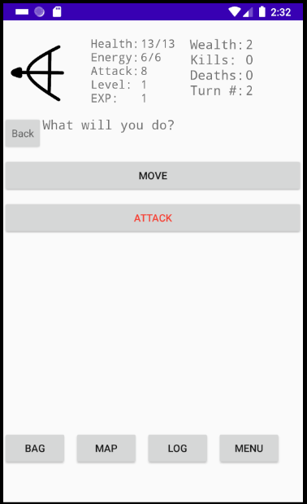

##### Attack (With AI Present in Location)
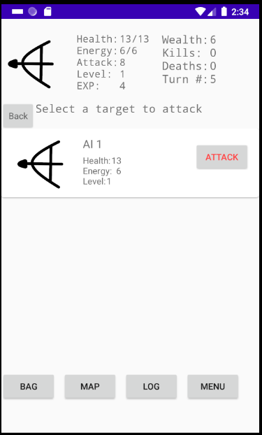

##### Bag (1 Consumable and 1 Weapon)
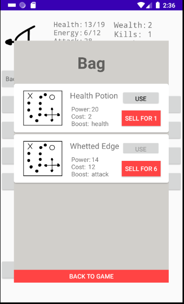

##### Map (With AI Present in Location)
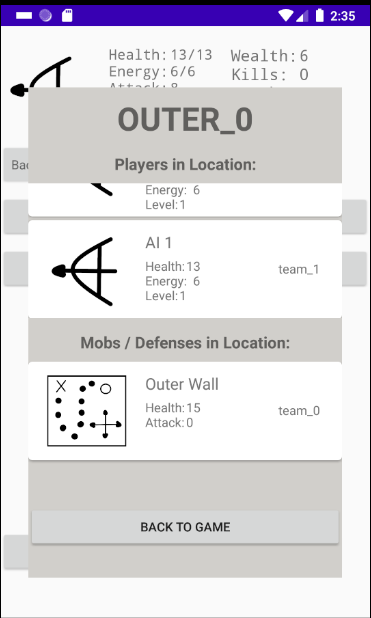

##### Game Log (Populated after a certain number of turns)
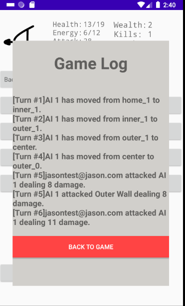

##### In-Game Menu
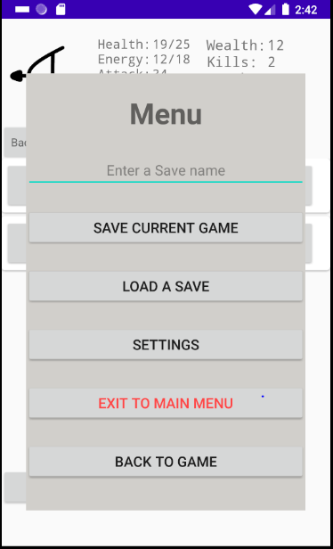